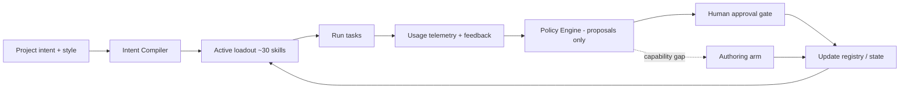

# skill-quartermaster
Non-destructive skill manager — compiles the right skill loadout per project, then demotes and hides unused skills to keep your context window lean. Never deletes without your approval.

<h1 align="center">🎖️ Quartermaster</h1>

<p align="center">
  <strong>A non-destructive skill manager for Claude Code.</strong><br>
  Compiles the right skill <em>loadout</em> for your project, then quietly demotes and hides the skills you aren't using —<br>
  so your context window stays lean and your skill set stays relevant. <strong>Nothing is ever deleted without your yes.</strong>
</p>

<p align="center">
  <!-- Replace these with real badges once published -->
  
  
  
  <a href="https://doi.org/10.5281/zenodo.21009805"></a>
</p>

---

## The problem

The skill ecosystem exploded. Mega-marketplaces ship hundreds of skills in one install; aggregators index tens of thousands of plugin repos. Two pains follow:

- **Context cost & noise.** A large installed set clutters the model's selection space and degrades tool-selection accuracy past a few dozen skills.
- **Curation burden.** You have to decide what to keep, what to drop, and when to write new skills — and today there isn't even a clean "turn this one off." The common workaround is to *rename `SKILL.md` to `_SKILL.md`* so the parser misses it.

People avoid cleanup tools because of one fear: **"what if it deletes the wrong thing?"** Quartermaster is built so that can't happen.

## What it does

Measured on **851 real open-source skills** (Anthropic + community hubs — see
[`benchmark/`](./benchmark/)):

```
851 skills installed  →  30 loaded for this project  →  ~57.5k tokens saved (96%)  →  0 deleted
```

| Claim | Evidence on the 851-skill corpus |
|---|---|
| Cuts the model's selection set | auto-select set **851 → 30** (28× smaller, at the ~30 sweet spot) |
| Saves context tokens | **~59.7k → ~2.2k** indexed tokens (~57.5k saved, 96%) |
| Never deletes | **851 → 851** files on disk, **0** deleted |
| Fully reversible | demote→restore **byte-identical on 200/200** sampled skills |
| Usage-driven curation | flags **809** stale skills to demote, then **737** to hide — fresh skills left active |
| **Keeps what the task needs** | trimmed loadout is **~10× more relevant than random**; **100% recall** of specifically-needed skills at cap=30 (vs 3.5% random) |
| **Doesn't hurt the agent** | live skill-selection A/B (`claude-opus-4-8`, 60 tasks): loadout **97%** vs full set **93%** (**+3 pts**, 100% recall) — trimming doesn't degrade which skill the model picks |

Full reports: [`BENCHMARK.md`](./BENCHMARK.md) (lifecycle + savings),
[`PERFORMANCE.md`](./PERFORMANCE.md) (capability retention — proof the token
savings don't drop the skills a task needs), and the live
[A/B selection eval](./benchmark/ab_eval/) (proof the loadout doesn't degrade
which skill the model picks). All reproducible from [`benchmark/`](./benchmark/).

### Does trimming hurt the agent? (live A/B)

Saving tokens is only worth it if the agent still picks the right skill. The
[`benchmark/ab_eval/`](./benchmark/ab_eval/) harness puts a real model
(`claude-opus-4-8`) in the loop and measures **skill-selection accuracy** on
tasks with known-correct skills, comparing the **full 851-skill set** against the
**~30-skill loadout**. Because both conditions share the same task wording, the
shared confounds cancel in the A−B difference — the hypothesis is **loadout ≥
full**.

```bash
pip install anthropic && export ANTHROPIC_API_KEY=sk-ant-...

# build the corpus once (clones real skill repos, dedupes into <name>/SKILL.md)
git clone --depth 1 https://github.com/davila7/claude-code-templates /tmp/c8
git clone --depth 1 https://github.com/anthropics/skills              /tmp/corpus
python3 benchmark/build_corpus.py /tmp/c8 /tmp/corpus --out /tmp/skillhub

# run the A/B (uses /tmp/c8 for the gold category labels)
python3 benchmark/ab_eval/run_ab_eval.py /tmp/skillhub /tmp/c8 --n 60
# writes benchmark/ab_eval/AB_RESULTS.md
```

Provider-agnostic — pick any model/provider, not just Anthropic:
`--provider openai --model gpt-4o`, any OpenAI-compatible endpoint via
`--base-url` (OpenRouter/Groq/Azure, or a **local** Ollama/vLLM/LM Studio), or
drive a real agent CLI with `--provider command --command "claude -p"` /
`"copilot -p"`. See [`benchmark/ab_eval/`](./benchmark/ab_eval/).

<!-- AB-RESULTS:START — paste the headline from benchmark/ab_eval/AB_RESULTS.md after the live run -->
**Live run** — `claude-opus-4-8`, 60 tasks (seed 7), full menu 840 skills, loadout cap 30:

| Condition | menu size | gold-hit accuracy |
|---|--:|--:|
| **A — full installed set** | 840 | **93%** |
| **B — Quartermaster loadout** | ≤30 | **97%** |
| Δ (loadout − full) | | **+3 pts** |

Recall (gold skill present in the loadout): **100%** · selection accuracy given present: **97%**.

**Trimming to the loadout did not hurt selection (97% vs 93%)** — the agent finds the
right skill at least as often with ~30 skills as with 840, at a fraction of the context
cost. Full report: [`benchmark/ab_eval/AB_RESULTS.md`](./benchmark/ab_eval/AB_RESULTS.md).
<!-- AB-RESULTS:END -->

Quartermaster manages the **lifecycle** of your skills instead of their content. It moves skills along a tiered ladder based on what you actually use — and keeps a human veto on anything irreversible.

| State | In context? | Auto-loadable? | You can invoke? | On disk? |
|---|:---:|:---:|:---:|:---:|
| **active** | ✅ indexed | ✅ | ✅ | ✅ |
| **demoted** | ✅ indexed | ❌ | ✅ manual | ✅ |
| **hidden** | ❌ | ❌ | ❌ | ✅ |
| **deleted** | ❌ | — | — | ❌ *(only after you approve)* |

Every transition is **logged and reversible**. Demote and hide happen automatically; **delete never does**.

## Quick start

```bash
# Add the marketplace
/plugin marketplace add <your-org>/skill-quartermaster

# Install
/plugin install quartermaster@skill-quartermaster
```

Once installed you get the `quartermaster` skill plus slash commands
(`/qm-status`, `/qm-compile`, `/qm-review`, `/qm-restore`) and the `qm` CLI:

```bash
qm status              # show every skill, its state, last-used, token cost
qm compile "<intent>"  # build an active loadout for this project
qm review              # see proposed demotions/promotions and approve them
qm restore <skill>     # bring anything back from demoted/hidden
qm demote <skill>      # take a skill out of auto-selection (manual-only)
qm hide <skill>        # remove a skill from context entirely
qm log                 # print the audit trail of every change
qm delete <skill> --yes  # human-gated removal (the only destructive action)

# Authoring arm — turn recurring gaps into new skills
qm gap "<need>"        # record a capability gap (a need with no matching skill)
qm gaps                # cluster gaps; recommend new skills to author
qm author <name>       # scaffold a probationary skill (hand off to skill-creator)
qm graduate <skill>    # end probation once a new skill has proven useful

# Feedback & undo
qm feedback "<gripe>"  # route a plain-language complaint to the right lever
qm revert              # undo the last automatic change (one-click revert)
```

> Quartermaster only ever *toggles states* and *proposes* changes. It will not remove a skill from disk unless you explicitly confirm with `--yes`.

### Try it without installing

The CLI is pure-Python (stdlib only). Point it at any folder of skills:

```bash
export QM_SKILLS_DIR=~/.claude/skills      # or your project's .claude/skills
python3 bin/qm status
```

Local state (usage telemetry + audit log) lives under `~/.quartermaster/`
(override with `QM_HOME`). Nothing ever leaves your machine.

## How it works



1. **Registry** — an index of every skill on disk with its state, description embedding, and last-used timestamp.
2. **Intent compiler** — selects an initial active set from your project intent + style file, kept near the ~30-skill accuracy sweet spot.
3. **Telemetry** — logs which skills actually fire per task (via skill hooks). Local-only; nothing leaves your machine.
4. **Policy engine** — *proposes* demotions (unused for N days), promotions (you keep invoking a demoted skill), and authoring (repeated gaps with no matching skill).
5. **Human gate** — batched approvals; deletion only after long-demoted **and** explicit confirmation.
6. **Authoring arm** — hands genuine gaps to `skill-creator`, admitting new skills as `active, probationary`.

Under the hood these states map to existing Claude Code primitives — Quartermaster configures them, it doesn't reinvent them.

## Why non-destructive matters

You're trusting a tool to touch your skills. Quartermaster's entire design is built around that trust:

- **Demote, don't delete** — unused skills drop out of the model's attention and out of context, but stay fully on disk and recoverable.
- **One-command restore** — `qm restore <skill>` reverses any single change; `qm revert` walks back the last N automatic changes from the audit trail.
- **Human-gated deletion** — the only path to removal runs through an explicit approval; `qm revert` deliberately refuses to undo a deletion or silently delete a skill.
- **Full audit log** — every state change (including each revert) is recorded and inspectable via `qm log`.

## Roadmap

| Phase | Scope | Status |
|---|---|---|
| **v0** | Lifecycle core: registry, state toggles, `qm status` + token-saved report | ✅ shipped |
| **v0.2** | Usage telemetry (PreToolUse hook) + demote-if-unused proposals + batched approvals (`qm review`) | ✅ shipped |
| **v0.3** | Intent compiler (`qm compile` — keyword loadout from project intent) | ◐ basic |
| **v0.4** | Authoring arm: gap detection (`qm gap`/`qm gaps`) → `skill-creator` handoff (`qm author`) → probationary admission + graduation | ✅ shipped |
| **v0.5** | Natural-language feedback (`qm feedback`) → style file / gap / promote / demote signals | ✅ shipped |
| **v1.0** | One-click revert (`qm revert`), full audit trail, marketplace listing; semantic-embedding compiler + dashboard | ◐ partial |

We ship the lifecycle half first on purpose — the compiler and authoring arm only earn their place once the simple half has users.

## Project layout

```
.claude-plugin/
  plugin.json          # plugin manifest (skill + commands + hooks)
  marketplace.json     # one-command install manifest
skills/quartermaster/  # the meta-skill that teaches Claude to drive qm
commands/              # /qm-status, /qm-compile, /qm-review, /qm-restore
hooks/                 # PreToolUse usage telemetry (local-only)
qm/                    # the pure-Python CLI
  registry.py          #   the shelf: scan skills, derive state from frontmatter
  transitions.py       #   non-destructive state changes + audit logging
  policy.py            #   the policy engine — proposes, never executes
  compile.py           #   intent compiler (keyword loadout)
  authoring.py         #   authoring arm: gap clustering + skill scaffolding
  feedback.py          #   route plain-language complaints to the right lever
  history.py           #   one-click revert from the audit trail
  store.py             #   local audit log + usage telemetry
  report.py            #   status table + token-saved report
  cli.py               #   argparse dispatch
bin/qm                 # zero-install entry point
tests/                 # pytest suite
```

Run the tests with `python3 -m pytest`.

## Contributing

Contributions welcome — especially telemetry hooks, policy rules, and adapters for other harnesses (Cursor, Copilot, Zed) via the open Agent Skills standard. Please open an issue describing the change before large PRs.

## License

MIT — see [LICENSE](./LICENSE).

---

<p align="center"><sub>Quartermaster manages your skills. It never loses them.</sub></p>
