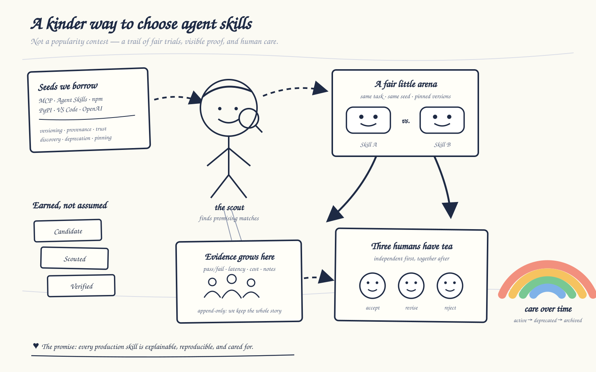
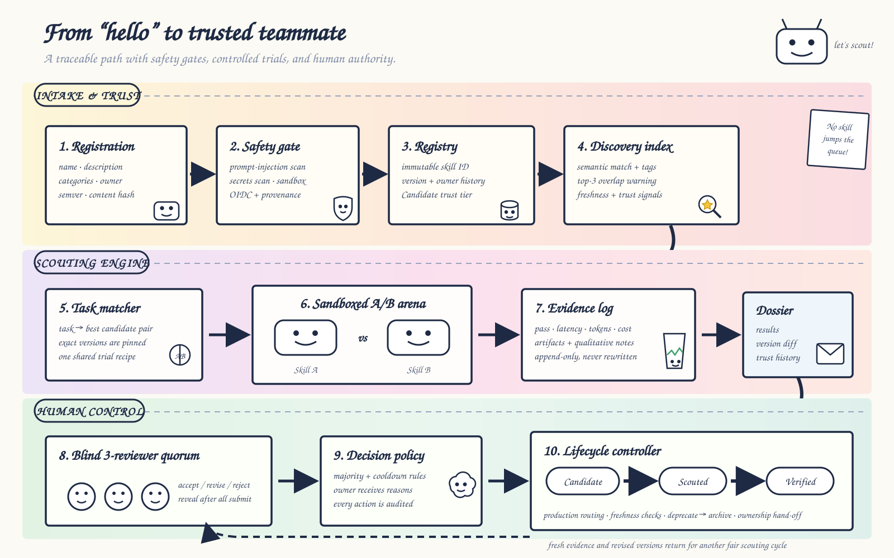

<h1 align="center">🎖️ Quartermaster</h1>

<p align="center">
  <strong>A kinder way to choose agent skills.</strong><br>
  Skills are the how-to guides your coding agent loads. Quartermaster picks the small set your project
  actually needs, proves new ones are worth it with fair side-by-side trials,<br>
  and leaves every final decision to a human. <strong>It never deletes anything without your yes.</strong>
</p>

<p align="center">
  
  
  
  <a href="https://doi.org/10.5281/zenodo.21009805"></a>
</p>

<p align="center">
  
</p>

---

## The problem, in plain words

Skill marketplaces ship hundreds of skills in one install. That hurts twice:

- **Your agent gets worse.** Every installed skill takes up context space, and past a few dozen the model starts picking the wrong one.
- **You become the janitor.** Which skills are safe? Which new one is actually better than what you have? There isn't even a clean "off switch" — people rename `SKILL.md` to `_SKILL.md` just to hide one.

And nobody trusts a cleanup tool, because of one fear: *what if it deletes the wrong thing?*

## What Quartermaster believes

Not a popularity contest — a trail of fair trials, visible proof, and human care.

1. **Trust is earned, not assumed.** A new skill starts as a *candidate*. It becomes trusted only by winning fair trials (*scouted*) and passing human review (*verified*). No skill jumps the queue.
2. **Fair trials, not stars.** To judge a skill, run it head-to-head against your current one — same task, same seed, pinned versions — and measure what happens.
3. **Evidence is append-only.** Results (pass/fail, latency, tokens, cost, notes) are recorded and never rewritten. You keep the whole story, including the trade-offs.
4. **Humans have the last word.** Three reviewers score the evidence blind and independently. The tool proposes; people decide. Every action is audited and reversible.

## How it works

The full path a skill travels, from first hello to trusted teammate:

<p align="center">
  
</p>

### 1 · Intake & trust — no skill jumps the queue

New skills come from public repos (`qm sources` lists curated ones). You clone a repo yourself, then Quartermaster **scans it without ever running its code**: it reads each `SKILL.md`, records name, description, and a content hash, and flags suspicious install/shell/data-exfiltration patterns. Only skills you accept with an explicit `--yes` are imported. Everything on your shelf lives in a registry (`qm status`) with its state, usage history, and full audit trail; `qm conflicts` warns when skills overlap or clash.

### 2 · Scouting engine — a fair little arena

Before anyone approves a candidate, Scout runs the trial. A **plan** pins the exact content hash and version of the candidate *and* your current default, then lays out randomized, repeated, paired jobs from a versioned task suite. Execution goes through a simple JSON stdin/stdout seam, so the actual model runs inside **your own sandboxed worker** — Copilot, Claude, Codex, whatever you use. If the pinned content changed since planning, Scout refuses to run. Trials land in an **append-only log**; the report aggregates them into a dossier with quality deltas, confidence intervals, cost, and known limitations — never one flattering score.

### 3 · Human control — three humans have tea

The dossier is **blinded** (no skill names) and scored by three reviewers, independently, with the candidate's author excluded. Two accepts approve; any substantiated safety veto blocks. Even then, Scout only produces a *decision file* — the actual lifecycle change (activate, demote, archive) goes through Quartermaster's normal human-gated review, and `qm revert` can walk any automatic change back. Deletion is the one destructive act, and it never happens without your explicit confirmation.

> The figures show the north star; a few pieces (prompt-injection scanning, OIDC provenance, semantic discovery) are still on the [roadmap](#roadmap). Everything invoked in **How to run** below works today.

## How to run

### Install as a Claude Code plugin

```bash
/plugin marketplace add ginaecho/skill-quartermaster
/plugin install quartermaster@skill-quartermaster
```

You get the `quartermaster` skill, 14 slash commands (`/qm-status`, `/qm-compile`, `/qm-review`, …), and the `qm` CLI.

### Or run with zero install

The CLI is pure Python, standard library only — nothing to `pip install`:

```bash
export QM_SKILLS_DIR=~/.claude/skills   # or your project's .claude/skills
python3 bin/qm status
```

### Daily loop — keep context lean

```bash
qm status              # every skill: state, last used, token cost
qm compile "<intent>"  # pick the ~30 skills this project needs (the "loadout")
qm review              # approve proposed demotions/promotions
qm restore <skill>     # bring anything back — one command
qm revert              # undo the last automatic change
qm log                 # audit trail of every change
```

### Bring in new skills — intake, then scout

```bash
# Intake: scan before you trust (never executes candidate code)
qm sources
git clone --depth 1 <repo-url> /tmp/skills-source
qm intake /tmp/skills-source --dry-run
qm intake /tmp/skills-source --import-to .claude/skills --yes

# Scout: fair A/B trial of a candidate vs. your current default
qm scout plan <candidate> --suite benchmark/scout/suite.example.json \
  --current-skill <current-default> --source <repo-url> --version <commit>
qm scout run scout-plan.json --runner python --runner-arg path/to/isolated_runner.py
qm scout report scout-plan.json scout-trials.jsonl     # dossier + blinded packet
qm scout review scout-evidence.json reviewer-votes.json --author <owner>
```

A ready-made Copilot runner and a worked case study live in [`benchmark/scout/`](./benchmark/scout/); schemas and trust boundaries in [`docs/SCOUTING.md`](./docs/SCOUTING.md).

### Care over time

```bash
qm demote <skill>        # out of auto-selection, still yours to invoke
qm hide <skill>          # out of context entirely, still on disk
qm archive <skill> --yes # reversible cold storage
qm delete <skill> --yes  # the only destructive action — always asks
qm gap "<need>"          # note a missing capability; qm gaps clusters them
qm author <name>         # scaffold a new skill on probation; qm graduate promotes it
qm feedback "<gripe>"    # plain-language complaint → the right lever
```

Local state (usage telemetry, audit log, skill history) lives in `~/.quartermaster/` (override with `QM_HOME`). **Nothing ever leaves your machine.** Run the tests with `python3 -m pytest` — 128 tests.

## Does it work? The numbers

Measured on **851 real open-source skills** (Anthropic + community hubs):

```
851 skills installed  →  30 loaded for this project  →  ~57.5k tokens saved (96%)  →  0 deleted
```

| Claim | Evidence |
|---|---|
| Smaller choice for the model | **851 → 30** skills (at the ~30 accuracy sweet spot) |
| Cheaper context | **~59.7k → ~2.2k** tokens (**96%** saved) |
| Never deletes | **851 → 851** files on disk, **0** deleted |
| Fully reversible | demote→restore **byte-identical on 200/200** sampled skills |
| Keeps what the task needs | **100% recall** of needed skills at cap 30 (vs 3.5% random) |
| Doesn't hurt the agent | live A/B (`claude-opus-4-8`, 60 tasks): loadout **97%** vs full set **93%** |

That last row is the point: with ~30 skills instead of 840, the agent picked the right skill *more* often — at a fraction of the cost. Full reports: [`BENCHMARK.md`](./BENCHMARK.md), [`PERFORMANCE.md`](./PERFORMANCE.md), [`benchmark/ab_eval/`](./benchmark/ab_eval/) (reproducible, provider-agnostic).

## The state ladder

| State | In context? | Auto-loadable? | You can invoke? | On disk? |
|---|:---:|:---:|:---:|:---:|
| **active** | ✅ indexed | ✅ | ✅ | ✅ |
| **demoted** | ✅ indexed | ❌ | ✅ manual | ✅ |
| **hidden** | ❌ | ❌ | ❌ | ✅ |
| **archived** | ❌ | ❌ | ❌ | ✅ *(outside active roots)* |
| **deleted** | ❌ | — | — | ❌ *(only after you approve)* |

Every transition is logged and reversible. Demote and hide happen automatically; **delete never does**. Skills may declare optional metadata in frontmatter (`qm-layer`, `qm-priority`, `qm-tags`, `qm-risk`, `qm-provides`, `qm-requires-guardrails`, `qm-conflicts-with`); skills without it load unchanged.

## Roadmap

| Phase | Scope | Status |
|---|---|---|
| **v0–v0.2** | Lifecycle core, usage telemetry, batched approvals | ✅ shipped |
| **v0.3** | Intent compiler (`qm compile`) | ◐ keyword-based |
| **v0.4–v0.5** | Authoring arm (gap → probation → graduate), natural-language feedback | ✅ shipped |
| **v0.6** | Skill Scout: pinned paired trials, append-only evidence, blind 3-reviewer quorum | ✅ shipped |
| **v1.0** | Semantic discovery index, prompt-injection & provenance gates, trust tiers, dashboard | ◐ in design |

## Project layout

```
.claude-plugin/   # plugin + marketplace manifests
skills/           # the meta-skill that teaches Claude to drive qm
commands/         # 14 /qm-* slash commands
hooks/            # usage telemetry (local-only)
qm/               # the pure-Python CLI — registry, policy, compile,
                  #   transitions, scout, intake, conflicts, adapters, …
benchmark/        # reproducible lifecycle, A/B, and scout benchmarks
docs/             # SCOUTING.md, figures, per-phase verification notes
bin/qm            # zero-install entry point
tests/            # pytest suite — 128 tests
```

## Contributing

Contributions welcome — especially telemetry hooks, policy rules, and adapters for other harnesses (Cursor, Copilot, Zed) via the open Agent Skills standard. Please open an issue before large PRs.

## License

MIT — see [LICENSE](./LICENSE).

---

<p align="center"><sub>♥ The promise: every production skill is explainable, reproducible, and cared for.</sub></p>
