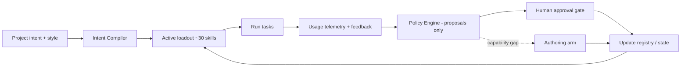

<h1 align="center">🎖️ Quartermaster</h1>

<p align="center">
  <strong>A non-destructive skill manager for coding agents.</strong><br>
  Compiles the right skill <em>loadout</em> for your project, then quietly demotes and hides the skills you aren't using —<br>
  so your context window stays lean and your skill set stays relevant. <strong>Nothing is ever deleted without your yes.</strong>
</p>

<p align="center">
  
  
  
  <a href="https://doi.org/10.5281/zenodo.21009805"></a>
</p>

---

## The problem

Mega-marketplaces ship hundreds of skills in one install. Two pains follow:

- **Context cost & noise.** A large installed set clutters the model's selection space and degrades tool-selection accuracy past a few dozen skills.
- **Curation burden.** There isn't even a clean "turn this one off" — the common workaround is renaming `SKILL.md` to `_SKILL.md` so the parser misses it.

People avoid cleanup tools out of one fear: **"what if it deletes the wrong thing?"** Quartermaster is built so that can't happen.

## What it does

Measured on **851 real open-source skills** (Anthropic + community hubs):

```
851 skills installed  →  30 loaded for this project  →  ~57.5k tokens saved (96%)  →  0 deleted
```

| Claim | Evidence |
|---|---|
| Cuts the selection set | **851 → 30** skills (28×, at the ~30 accuracy sweet spot) |
| Saves context | **~59.7k → ~2.2k** tokens (~57.5k saved, **96%**) |
| Never deletes | **851 → 851** files on disk, **0** deleted |
| Fully reversible | demote→restore **byte-identical on 200/200** sampled skills |
| Usage-driven | flags **809** stale skills to demote, then **737** to hide |
| **Keeps what the task needs** | **100% recall** of needed skills at cap=30 (vs 3.5% random) |
| **Doesn't hurt the agent** | live A/B (`claude-opus-4-8`, 60 tasks): loadout **97%** vs full set **93%** — **+3 pts** |

That last row is the one that matters: trimming to ~30 skills **improved** selection accuracy over the full 840-skill menu, at a fraction of the context cost.

Full reports — [`BENCHMARK.md`](./BENCHMARK.md) (savings), [`PERFORMANCE.md`](./PERFORMANCE.md) (capability retention), [`benchmark/ab_eval/`](./benchmark/ab_eval/) (live A/B, provider-agnostic). All reproducible from [`benchmark/`](./benchmark/).

## The state ladder

Quartermaster manages the **lifecycle** of skills, not their content:

| State | In context? | Auto-loadable? | You can invoke? | On disk? |
|---|:---:|:---:|:---:|:---:|
| **active** | ✅ indexed | ✅ | ✅ | ✅ |
| **demoted** | ✅ indexed | ❌ | ✅ manual | ✅ |
| **hidden** | ❌ | ❌ | ❌ | ✅ |
| **archived** | ❌ | ❌ | ❌ | ✅ *(outside active roots)* |
| **deleted** | ❌ | — | — | ❌ *(only after you approve)* |

Every transition is **logged and reversible**. Demote and hide happen automatically; **delete never does**.

## Quick start

```bash
/plugin marketplace add ginaecho/skill-quartermaster
/plugin install quartermaster@skill-quartermaster
```

You get the `quartermaster` skill, 14 slash commands (`/qm-status`, `/qm-compile`, `/qm-review`, `/qm-restore`, …), and the `qm` CLI.

**Or run it with zero install** — the CLI is pure-Python, stdlib only:

```bash
export QM_SKILLS_DIR=~/.claude/skills   # or your project's .claude/skills
python3 bin/qm status
```

### Commands

```bash
# Core lifecycle
qm status              # every skill, its state, last-used, token cost
qm compile "<intent>"  # build an active loadout for this project
qm review              # approve proposed demotions/promotions
qm restore <skill>     # bring anything back from demoted/hidden
qm demote / hide / archive <skill>    # non-destructive state changes
qm delete <skill> --yes               # the only destructive action

# Insight & undo
qm log                 # audit trail of every change
qm history <skill>     # historical usage/selection metadata
qm conflicts           # explicit/inferred skill conflicts
qm revert              # undo the last automatic change
qm feedback "<gripe>"  # route a complaint to the right lever

# Growing the shelf
qm sources             # curated external skill repos
qm intake <repo> --dry-run            # scan a checkout (never executes candidate code)
qm gap "<need>" / qm gaps             # record & cluster capability gaps
qm author <name>       # scaffold a probationary skill
qm graduate <skill>    # end probation once proven useful

# Runtimes
qm runtimes            # list adapters (claude, codex, copilot, vscode, generic)
qm runtime-setup codex # write local setup files
```

> Quartermaster only *toggles states* and *proposes* changes. It will not remove a skill from disk without an explicit `--yes`.

## Skill Scout — evidence before approval

Don't guess whether a new skill is worth installing. Scout compares a candidate against **both** no-skill behavior and your current default, then produces a reviewable evidence packet.

```bash
qm scout plan <candidate> --suite benchmark/scout/suite.example.json \
  --current-skill <current-default> --source <repo-url> --version <commit>
qm scout run scout-plan.json --runner python --runner-arg path/to/isolated_runner.py
qm scout report scout-plan.json scout-trials.jsonl
qm scout review scout-evidence.json reviewer-votes.json --author <owner>
```

- **Reproducible.** Plans pin the candidate's content hash and randomize repeated paired jobs; Scout re-hashes before execution and rejects plans whose inputs changed.
- **Honest.** Reports keep quality, completion, selection accuracy, reliability, time, tokens, cost, safety findings, confidence intervals, and known limitations — instead of hiding trade-offs in one score.
- **Provider-neutral.** Execution crosses a JSON stdin/stdout runner seam, so you run Copilot, Claude, or Codex in your own ephemeral least-privilege worker.
- **Human-decided.** A blinded packet is scored by three independent reviewers; two accepts approve, any substantiated safety veto blocks. Scout never changes a skill's state itself.

See [`docs/SCOUTING.md`](./docs/SCOUTING.md) for schemas, runner integration, and trust boundaries.

## How it works


```mermaid
flowchart LR
    A[Project intent + style] --> B[Intent Compiler]
    B --> C[Active loadout ~30 skills]
    C --> D[Run tasks]
    D --> E[Usage telemetry + feedback]
    E --> F[Policy Engine - proposals only]
    F --> G[Human approval gate]
    G --> H[Update registry / state]
    H --> C
    F -. capability gap .-> I[Authoring arm]
    I --> H
```

1. **Registry** — indexes every skill on disk with state, description, and last-used timestamp.
2. **Intent compiler** — selects the active set from your project intent, near the ~30-skill sweet spot.
3. **Telemetry** — logs which skills actually fire, via hooks. Local-only.
4. **Historical dictionary** — first/last seen, usage and selection counts, transitions, useful intents.
5. **Policy engine** — *proposes* demotions, promotions, and authoring. Never executes.
6. **Human gate** — batched approvals; deletion only after long-demoted **and** explicit confirmation.
7. **Authoring arm** — hands genuine gaps to `skill-creator` as probationary skills.

Local state lives under `~/.quartermaster/` (override with `QM_HOME`). **Nothing ever leaves your machine.**

Skills can optionally declare metadata in frontmatter (`qm-layer`, `qm-priority`, `qm-tags`, `qm-risk`, `qm-provides`, `qm-requires-guardrails`, `qm-conflicts-with`). All of it is optional — existing skills load unchanged.

## Why non-destructive matters

- **Demote, don't delete** — unused skills leave the model's attention and your context, but stay on disk and recoverable.
- **One-command restore** — `qm restore <skill>` reverses any change; `qm revert` walks back the last automatic ones.
- **Human-gated deletion** — `qm revert` deliberately refuses to undo a deletion or silently delete a skill.
- **Full audit log** — every state change, including each revert, is inspectable via `qm log`.

## Roadmap

| Phase | Scope | Status |
|---|---|---|
| **v0** | Lifecycle core: registry, state toggles, token-saved report | ✅ shipped |
| **v0.2** | Usage telemetry + demote-if-unused proposals + batched approvals | ✅ shipped |
| **v0.3** | Intent compiler (`qm compile`) | ◐ basic |
| **v0.4** | Authoring arm: gap detection → `skill-creator` → probation → graduation | ✅ shipped |
| **v0.5** | Natural-language feedback (`qm feedback`) | ✅ shipped |
| **v0.6** | Skill Scout: paired A/B evidence, blinded review, integrity-bound artifacts | ✅ shipped |
| **v1.0** | One-click revert, full audit trail, marketplace listing; semantic compiler + dashboard | ◐ partial |

## Project layout

```
.claude-plugin/   # plugin + marketplace manifests
skills/           # the meta-skill that teaches Claude to drive qm
commands/         # 14 /qm-* slash commands
hooks/            # PreToolUse usage telemetry (local-only)
qm/               # the pure-Python CLI (registry, policy, compile,
                  #   transitions, scout, intake, conflicts, adapters, …)
benchmark/        # reproducible lifecycle, A/B, and scout benchmarks
docs/             # SCOUTING.md + per-phase verification notes
bin/qm            # zero-install entry point
tests/            # pytest suite — 128 tests
```

Run the tests with `python3 -m pytest`.

## Contributing

Contributions welcome — especially telemetry hooks, policy rules, and adapters for other harnesses (Cursor, Copilot, Zed) via the open Agent Skills standard. Please open an issue before large PRs.

## License

MIT — see [LICENSE](./LICENSE).

---

<p align="center"><sub>Quartermaster manages your skills. It never loses them.</sub></p>
